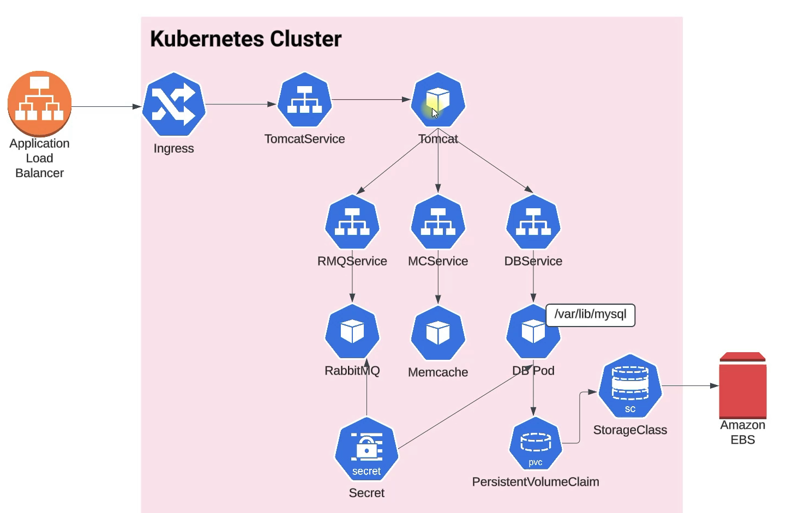

# VPROKUBE

This project is a model of application and infrastructure provisioned by Kubernetes about AWS EKS and another resources. 

## Prerequisites
- Docker and Docker Compose
- kubectl
- AWS CLI configured
- Terraform
- Access to an AWS account

## Technologies 
- Spring MVC
- Spring Security
- Spring Data JPA
- Maven
- JSP
- Tomcat
- MySQL
- Memcached
- Rabbitmq
- ElasticSearch

## Components
1. **Application Stack**
   - Web Frontend (Nginx)
   - Application Backend
   - MySQL Database
   - RabbitMQ for message queuing
   - Memcached for caching

2. **Infrastructure**
   - AWS EKS Cluster (managed by Terraform)
   - Encrypted EBS volumes for persistence
   - Load Balancer for ingress

   

## Local Development
To run the application locally:
```bash
docker-compose up -d
```

## Project
```bash
.
├── docker-compose.yml # Local development environment setup
├── Docker-files/ # Docker configuration files
│ ├── app/ # Application container
│ │ ├── Dockerfile
│ │ └── multistage/ # Multi-stage build optimization
│ ├── db/ # Database container
│ │ ├── db_backup.sql # Database initialization
│ │ └── Dockerfile
│ └── web/ # Web server container
│ ├── Dockerfile
│ └── nginvproapp.conf # Nginx configuration
├── kubedefs # Kubernets infraestructure
│   ├── appdeploy.yaml # App interface configurations
│   ├── appingress.yaml # Ingres-Nginx routing configurations
│   ├── appservice.yaml # App service 
│   ├── dbdeploy.yaml # Database configurations
│   ├── dbpvc.yaml # DB persistente volume
│   ├── dbservice.yaml # DB service
│   ├── mcdep.yaml # Memcached configurations
│   ├── mcservice.yaml # Memcached service
│   ├── namespace.yml # Namespace definition
│   ├── rmqdeploy.yaml #RabbitMQ configurations
│   ├── rmqservice.yaml # RabbitMQ service
│   ├── secret.yaml # Secrets management
│   └── storageclass.yaml  # Storage definitions
├── README.md # Documentation
└── terraform
    ├── # Terraform IaC EKS
```

## Kubernetes Deployment
1. Set up Infrastructure

```bash
cd terraform
terraform init
terraform apply
```

2. Deploy Application
```bash
# Create namespace
kubectl apply -f kubedefs/namespace.yml

# Apply configurations
kubectl apply -f kubedefs/.
```
3. Verify Deployment
```bash
kubectl get pods
kubectl get svc
kubectl get ingress
```
## Storage Configuration
- Uses AWS EBS for persistent storage

- Encrypted volumes using AWS KMS

- Dynamic provisioning via StorageClass

# Security Features
- Encrypted storage volumes

- Kubernetes secrets management

- Namespace isolation

- AWS IAM integration

## Monitoring and Maintenance
1. Check Application Status
```bash
kubectl get pods -o wide
kubectl describe pod <pod-name>
```
2. View Logs
```bash
kubectl logs <pod-name>
```

## Scaling
1. The application components can be scaled horizontally:
```bash
kubectl scale deployment <deployment-name> --replicas=<number>
```

## Cleanup
1. Remove Kubernetes Resources

```bash
kubectl delete -f kubedefs/.
```
2. Destroy Infrastructure

```bash
cd terraform
terraform destroy
```

## Database
Here, we used Mysql DB sql dump file:
- /src/main/resources/db_backup.sql
- db_backup.sql file is a mysql dump file.we have to import this dump to mysql db server
- > mysql -u <user_name> -p accounts < db_backup.sql


## Contributing
Fork the repository

Create a feature branch

Commit changes

Create a pull request

# License
MIT
